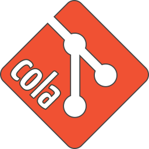
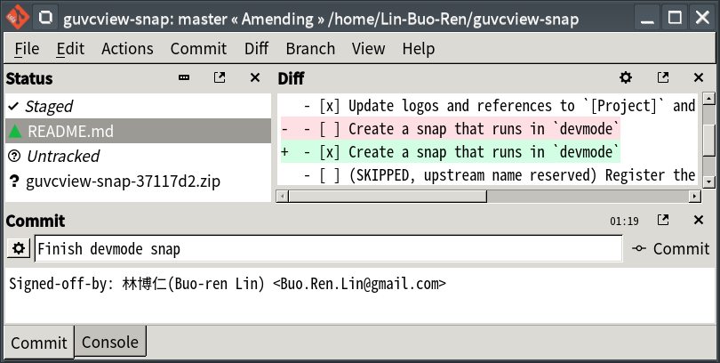

# Snap Packaging for Git Cola



**This is the snap for Git Cola**, *"The highly caffeinated Git GUI"*. It works on Ubuntu, Fedora, Debian, and other major Linux distributions.

[](https://build.snapcraft.io/user/Lin-Buo-Ren/git-cola-snap)



Published for  with 💝 by Snapcrafters

## Installation

```
# Install Snap
sudo snap install git-cola

# Connect the Snap to Optional Interfaces
## gpg-keys: For signing commits and tags
sudo snap connect git-cola:gpg-keys

## removable-media: For accessing Git repositories under `/media/*` and `/run/media/*`
sudo snap connect git-cola:removable-media

## ssh-keys: For remote operation via SSH protocol
sudo snap connect git-cola:ssh-keys

```

([Don't have snapd installed?](https://snapcraft.io/docs/core/install))

## What is Working

- Launch
- I18N
- Launch help webpages
- Initialize new repository
- Clone existing repository
- Modify Git config
- Modify Git remotes
- File system change monitoring
- Launch host editor for editing files
- Stage changes
- Commit changes
- Remote fetch
- Remote push
- Create branch
- Rebase
- DAG view
- Stash
- File browser
- Visualize via gitk
- Compare differences between expressions/branches

## What is NOT Working...yet

- (None as of now)

## What is NOT Working...but expected to be so

* Hook scripts that require external commands from the host won't be working due to security confinement, you may workaround it by disabling the security confinement or toggle the "Bypass Commit Hooks" switch in the "Actions..." menu in the commit widget.

## What is NOT Tested...yet

- send2trash
- grep
- Git Large File Storage
- Git Annex

And all the things not listed in the "What is Working" section

## Support

- [Issue Tracker](https://github.com/Lin-Buo-Ren/git-cola-snap/issues)